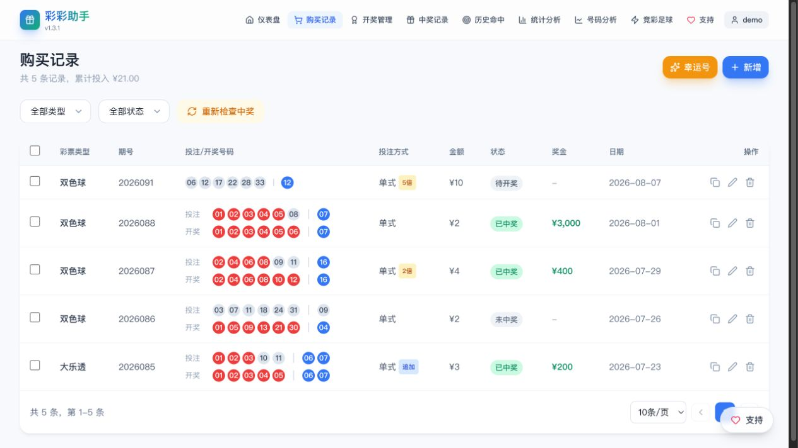
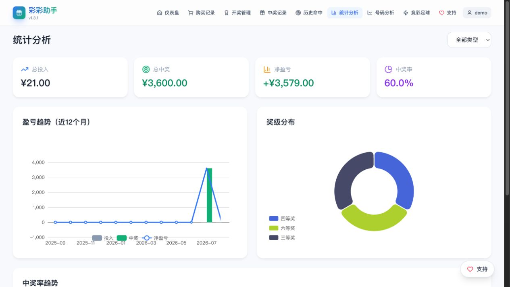
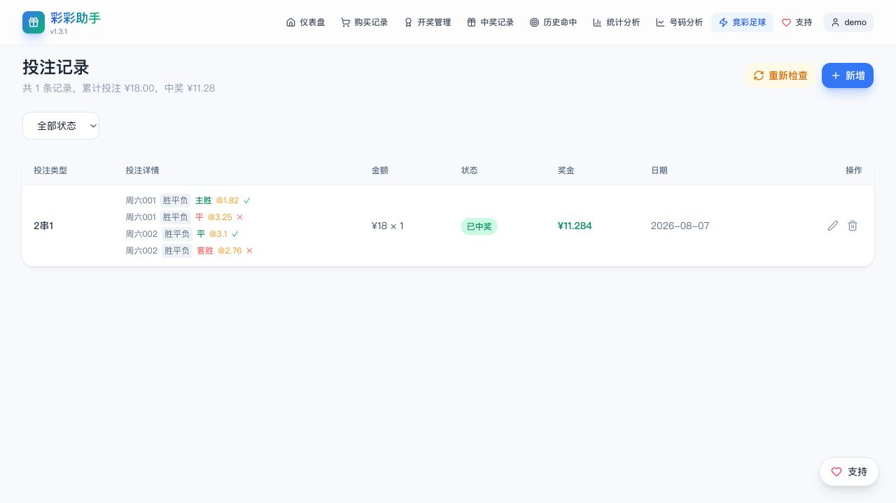

# 彩彩助手

一个帮助您记录彩票购买、自动识别中奖情况、并提供全面统计分析的系统。

> **当前版本**: v1.3.1 | **开源协议**: MIT

**注意**: 本应用包含匿名使用统计功能，会收集设备标识码用于统计独立设备数量。详情请查看 [PRIVACY_POLICY.md](PRIVACY_POLICY.md)。

## 功能特性

### 彩票管理
- **支持 7 种彩票类型**：双色球、大乐透、福彩3D、排列3、排列5、七乐彩、七星彩
- **购买记录管理**：记录购买日期、彩票类型、期号、选号、购买金额、投注方式
- **批量复制**：选中多条记录，统一修改日期和期号后批量创建
- **幸运号生成**：一键随机生成号码并快速添加到购买记录

### 开奖与中奖
- **开奖结果管理**：支持手动录入和自动抓取开奖结果
- **中奖自动识别**：根据彩票规则自动匹配号码，识别中奖等级和奖金
- **双色球福运奖**：支持按期手动标记（中3红奖5元）
- **历史命中统计**：查看号码历史出现次数和分布

### 数据分析
- **号码分析页面**：频率图、遗漏图、走势图、和值跨度走势
- **盈亏总览**：总投入 vs 总中奖金额，净收益统计
- **奖级分布**：各奖级中奖次数和金额分布饼图
- **趋势分析**：月度投入/中奖趋势图，中奖率变化

### 竞彩足球
- **赛事管理**：从 sporttery 官方抓取赛程和赔率
- **投注记录**：支持单关和串关（2-8串1）
- **结果抓取**：从 api-football 获取比赛结果并自动计算中奖
- **盈亏概览**：足球投注的投入产出统计

### 用户系统
- **多用户支持**：用户注册、登录、权限管理
- **数据隔离**：每个用户只能访问自己的数据
- **管理员功能**：用户管理、全局配置、系统升级

## 界面预览

| 仪表盘 | 购买记录 |
| --- | --- |
|  |  |

| 统计分析 | 竞彩足球 |
| --- | --- |
|  |  |

### 足球投注记录



## 技术栈

| 层级 | 技术 |
|------|------|
| 前端 | Vue 3 + TypeScript + Vite + TailwindCSS + ECharts |
| 后端 | Go 1.25 + Gin + GORM |
| 数据库 | SQLite (pure Go, 无 CGo 依赖) |
| 日志 | Zap + Lumberjack (日志轮转) |
| 认证 | JWT + MD5 双重密码加密 |

## 项目结构

```
lottery/
├── backend/                    # Go 后端
│   ├── main.go                # 程序入口
│   ├── models/                # 数据模型
│   │   ├── models.go          # 购买/开奖/中奖记录
│   │   ├── user.go            # 用户模型
│   │   ├── football.go        # 足球模型
│   │   └── config.go          # 系统配置
│   ├── handlers/              # API 处理器
│   │   ├── auth_handler.go    # 认证接口
│   │   ├── purchase_handler.go # 购买记录
│   │   ├── draw_handler.go    # 开奖管理
│   │   ├── stats_handler.go   # 统计分析
│   │   ├── football_handler.go # 竞彩足球
│   │   └── config_handler.go  # 系统配置
│   ├── services/              # 业务逻辑
│   │   ├── auth_service.go    # 认证服务
│   │   ├── football_service.go # 足球数据抓取
│   │   ├── analysis_service.go # 号码分析
│   │   └── upgrade_service.go # 系统升级
│   ├── rules/                 # 彩票规则引擎
│   │   ├── calculator.go      # 彩票中奖计算
│   │   └── football_calculator.go # 足球中奖计算
│   ├── migrations/            # 数据库迁移
│   ├── database/              # 数据库连接
│   ├── middleware/             # 中间件 (JWT)
│   └── logger/                # 日志配置
├── frontend/                   # Vue 前端
│   └── src/
│       ├── views/             # 页面视图 (12个)
│       │   ├── HomeView.vue           # 仪表盘
│       │   ├── PurchaseView.vue       # 购买记录
│       │   ├── DrawView.vue           # 开奖管理
│       │   ├── WinningsView.vue       # 中奖记录
│       │   ├── HistoryHitView.vue     # 历史命中
│       │   ├── StatisticsView.vue     # 统计分析
│       │   ├── AnalysisView.vue       # 号码分析
│       │   ├── FootballView.vue       # 竞彩足球
│       │   ├── FootballMatchView.vue  # 比赛管理
│       │   ├── FootballBetView.vue    # 投注记录
│       │   ├── SettingsView.vue       # 数据源设置
│       │   └── UserManageView.vue     # 用户管理
│       ├── components/        # 组件
│       │   ├── NumberInput.vue        # 彩票号码输入
│       │   ├── DigitNumberInput.vue   # 数字型彩票输入
│       │   ├── FootballBetForm.vue    # 足球投注表单
│       │   └── analysis/             # 分析图表组件
│       │       ├── FrequencyChart.vue # 频率图
│       │       ├── OmissionChart.vue  # 遗漏图
│       │       ├── TrendChart.vue     # 走势图
│       │       └── MetricsChart.vue   # 指标图
│       ├── api/index.ts       # API 封装
│       ├── types/index.ts     # TypeScript 类型定义
│       ├── router/index.ts    # 路由配置
│       └── utils/crypto.ts    # 密码加密工具
├── techfunway-lottery/         # 飞牛 NAS 应用
│   ├── manifest               # 应用清单 (版本/描述/更新日志)
│   ├── app/                   # 应用资源
│   └── wizard/                # 安装向导
├── Dockerfile                  # Docker 开发镜像 (多阶段构建)
├── Dockerfile.release          # Docker 发布镜像 (基于 scratch)
├── Makefile                    # 构建脚本
└── scripts/                    # 构建与发布脚本
    ├── cross-platform-compile.sh
    ├── package-multiplatform.sh
    ├── frontend-build.sh
    └── docker-builder.sh
```

## 快速开始

### 方式一：Docker 部署 (推荐)

```bash
# 拉取镜像
docker pull techfunways/lottery:latest

# 运行
docker run -d \
  --name lottery \
  -p 8902:8902 \
  -v ./data:/app/data \
  techfunways/lottery:latest
```

访问地址：`http://localhost:8902`

### 方式二：Docker Compose

```bash
# 固定版本
docker-compose -f docker-compose-v1.3.1.yml up -d

# 自动更新版（含 watchtower）
docker-compose -f docker-compose-latest.yml up -d
```

### 方式三：源码构建

```bash
# 一键开发环境
make dev

# 访问 http://localhost:8902
```

### 方式四：手动启动

```bash
# 后端
cd backend && go run main.go

# 前端（开发模式）
cd frontend && npm install && npm run dev
```

## 配置说明

### 命令行参数

```bash
./lottery -port 9000 -data-dir /var/lottery/data
```

| 参数 | 说明 | 默认值 |
|------|------|--------|
| `-port` | 服务端口 | 8902 |
| `-data-dir` | 数据目录 | ./data |
| `-web-dir` | 前端目录 | ./ |
| `-version` | 显示版本号 | - |

### 环境变量

| 变量 | 说明 | 默认值 |
|------|------|--------|
| `PORT` | 服务端口 | 8902 |
| `DATA_DIR` | 数据目录 | ./data |
| `DB_PATH` | 数据库路径 | ./data/db/database.db |
| `ENV` | 运行环境 | production |
| `DISABLE_STATS` | 禁用统计 | false |
| `API_FOOTBALL_KEY` | 足球 API Key | - |

## 数据存储

```
data/
├── db/                     # 数据库文件
│   └── lottery-assistant.db
├── logs/                   # 日志文件
│   ├── app.log
│   └── app-*.log
└── device_id.txt           # 设备标识码
```

### 数据库表

| 表名 | 说明 |
|------|------|
| `users` | 用户信息 |
| `purchase_records` | 购买记录 |
| `draw_results` | 开奖结果 |
| `winning_records` | 中奖记录 |
| `football_matches` | 足球比赛 |
| `football_bets` | 足球投注 |
| `system_configs` | 系统配置 |

## 构建发布

```bash
# 完整发布流程
make release
```

这会自动：
1. 构建前端
2. 跨平台编译 (macOS/Linux/Windows × amd64/arm64)
3. 打包飞牛 NAS 应用 (.fpk)
4. 生成 Docker 镜像

### 输出目录

```
release/v1.3.1/
├── lottery-assistant-v1.3.1-darwin-amd64/
├── lottery-assistant-v1.3.1-darwin-arm64/
├── lottery-assistant-v1.3.1-linux-amd64/
├── lottery-assistant-v1.3.1-linux-arm64/
├── lottery-assistant-v1.3.1-windows-amd64/
├── lottery-assistant-v1.3.1-windows-arm64/
├── techfunway-lottery-v1.3.1-arm.fpk
└── techfunway-lottery-v1.3.1-x86.fpk
```

### Docker 镜像

```bash
# 构建多架构镜像
bash scripts/docker_builder.sh

# 输出
techfunways/lottery:v1.3.1
techfunways/lottery:latest
```

## 开发指南

### 添加新彩票类型

1. `backend/models/models.go` - 添加类型枚举
2. `backend/rules/calculator.go` - 实现中奖计算
3. `frontend/src/types/index.ts` - 添加类型配置
4. `frontend/src/components/NumberInput.vue` - 适配输入

### 查看日志

```bash
tail -f data/logs/app.log
grep ERROR data/logs/app.log
```

## 版本更新日志

### v1.3.1 (2026-08-07)

**改进**
- 补充移动端网页快捷方式图标
- API-Football 配置状态按当前用户实际生效的 Key 显示

**Bug 修复**
- 修复 API-Football 返回业务错误时被误判为“暂无结果”的问题
- 修复隔天补抓时，已标记为“已完赛”但没有比分的比赛无法回填赛果
- 修复竞彩足球同场多选被错误按全部命中计算，导致复式二串一误判未中奖
- 修复“重新检查”仅处理待开奖记录，历史误判记录无法自动纠正

### v1.3.0 (2026-07-07)

**新功能**
- 号码分析：完整的开奖号码分析页面，包含频率图、遗漏图、走势图、和值跨度走势
- 双色球：福运奖按期手动标记（中3红奖5元）
- 应用图标改为 emerald 绿主题

**改进**
- 号码输入框：单位数自动补零显示（如 5 显示为 05）
- 号码输入框：支持方向键在输入框间导航
- 购买记录：支持批量复制，统一修改日期和期号
- 顶部导航栏：优化排版，解决菜单项过多导致文字换行问题

**Bug 修复**
- 修复：号码分析走势图 tooltip 显示真实号码
- 修复：批量复制购买记录部分失败时无回滚提示
- 修复：号码分析服务按开奖日期排序可能不精确

### v1.2.0 (2026-04-13)

**新功能**
- 竞彩足球：数据源切换为 sporttery 官方 + api-football
- 竞彩足球：内置 130+ 条中英队名映射
- API-Football Key 自服务/全局/内置三级配置

**Bug 修复**
- 修复：第三方接口失效导致抓取失败
- 修复：Docker 镜像抓取赛程失败 (TLS 问题)

### v1.1.2 (2026-03-20)

**改进**
- 定时抓取：启动后立即执行，新增多时段自动抓取

### v1.1.1 (2026-03-15)

**Bug 修复**
- 修复：双色球输入两位数时重复校验误触

### v1.1.0 (2026-03-10)

**新功能**
- 竞彩足球：完整的赛事管理、投注、开奖、盈亏概览
- 定时抓取：每日凌晨自动抓取开奖号码

**Bug 修复**
- 修正大乐透、七乐彩、排列3 奖金表
- 修复复式投注中奖计算逻辑

## 开源协议

MIT License

## 项目地址

- GitHub: https://github.com/TechFunWay/lottery
- Gitee: https://gitee.com/TechFunWay/lottery
- 飞牛应用: http://techfunway.wycto.cn/fnapp/lottery/
